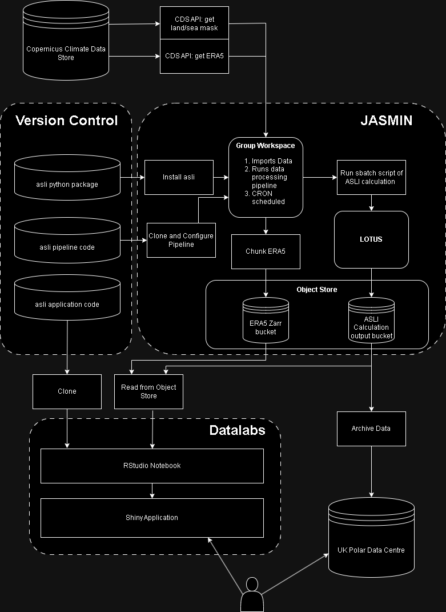

# asli-pipeline
This repository contains a pipeline for operational execution of the Amundsen Sea Ice Low calculations, provided in the `asli` package. The functions in the `asli` package are described in detail in the [package repository](https://github.com/davidwilby/amundsen-sea-low-index) `amundsen-sea-low-index` (Hosking & Wilby 2024), and in _Hosking et al. (2016)_.

## Get the repository
Clone this repository into a directory on your computer or HPC.
```
git clone git@github.com:antarctica/boost-eds-pipeline.git asli
```

## Creating an environment
```bash
# if you are working on JASMIN you will need to load in jaspy
module load jaspy 

python -m venv asli_env

source asli_env/bin/activate
```

### Installing dependencies
To install all dependencies, inlcuding the `asli` package, run:
```bash
pip install -r requirements.txt
```

### Packages and Virtual Environments on JASMIN
If you are working on JASMIN, it is good to familiarise yourself with managing software environments on Jasmin:
   1. [Quick Start on software for JASMIN](https://help.jasmin.ac.uk/docs/software-on-jasmin/quickstart-software-envs/)
   2. [Python Virtual Environments for JASMIN](https://help.jasmin.ac.uk/docs/software-on-jasmin/python-virtual-environments/).

## Setting up Climate Data Store API
The `asli` package will not be able to download ERA5 data without access to the [Copernicus Climate Data Store](https://cds.climate.copernicus.eu/cdsapp#!/home).

Follow these instructions to set up CDS API access: [How to Use The CDS API](https://cds-beta.climate.copernicus.eu/how-to-api).

```bash
nano $HOME/.cdsapirc
# Paste in your {uid} and {api-key} 
```

## Configuration
This pipeline revolves around the `ENVS` file to provide the necessary configuration items. This can easily be derived from the `ENVS.example` file to a new file, then symbolically linked. Comments are available in `ENVS.example` to assist you with the editing process.
```bash
cp ENVS.example ENVS.myconfig
ln -sf ENVS.myconfig ENVS
# Edit ENVS.myconfig to customise parameters for the pipeline
```
## Data Output
The pipeline allows data output to the JASMIN Object Store, a local file system, or both - depending on where you are running this pipeline and which output file formats you would like to use.

### Data Output to JASMIN Object Store
The pipeline uses `s3cmd` to interact with S3 compatible Object Storage. If you configure your data to be written out to the JASMIN Object Store, you will need to configure `s3cmd` to access your object storage tenancy and bucket.

You will need to generate an access key, and store it in a `~/.s3cfg` file. Full instructions on how to [generate an access key on JASMIN](https://help.jasmin.ac.uk/docs/short-term-project-storage/using-the-jasmin-object-store/#creating-an-access-key-and-secret) and an [s3cfg file](https://help.jasmin.ac.uk/docs/short-term-project-storage/using-the-jasmin-object-store/#using-s3cmd)  to use `s3cmd` are in the JASMIN documentation.

### Data Output to local file system
If you require data to be copied to a different location (e.g. the BAS SAN, for archival into the Polar Data Centre) you can configure this destination in `ENVS`. This will then `rsync` your output to that location.

## Running the pipeline manually
Before running the pipeline, make sure you have followed the steps above:
   1. Cloned the pipeline.
   2. Set up your environment.
   3. Installed `asli`.
   4. Set CDS API access with `.cdsapirc`.
   5. Set configurations `ENVS.myconfig` and symbolically linked to `ENVS`.
   6. Set configurations for the Object Store in `.s3cfg`.

You can now run the pipeline:
```bash
deactivate # Your environment is set in ENVS, so you do not need to call it
bash run_asli_pipeline.sh
```

## Automating the pipeline with cron
A cron example has been provided in the `cron.example` file.

```bash
crontab -e

# Then edit the file, for example to run once a month:
0 3 1 * * cd $HOME/boost-eds-pipeline && bash run_asli_pipeline.sh; deactivate

# OR on JASMIN we are using crontamer:
0 3 1 * * crontamer -t 2h -e youremail@address.ac.uk 'cd gws/nopw/j04/dit/users/thozwa/boost-eds-pipeline && bash run_asli_pipeline.sh; deactivate'
```
For more information on using cron on JASMIN, see [Using Cron](https://help.jasmin.ac.uk/docs/workflow-management/using-cron/) in the JASMIN documentation, and the [crontamer](https://github.com/cedadev/crontamer) package. The purpose of `crontamer` is to stop multiple process instances starting. It also times out after x hours and emails on error.

## Deployment Example
The following describes an example deployment setup for this pipeline. This was done under the BOOST-EDS project.

We are using a [JASMIN](https://jasmin.ac.uk/) group workspace (GWS) to run a data processing pipeline. Using the [Copernicus Climate Data Store API](https://cds.climate.copernicus.eu/#!/home), ERA5 data is read in. Calculations are then performed on [LOTUS](https://help.jasmin.ac.uk/docs/batch-computing/lotus-overview/) using `asli` functions.Output data is stored on [JASMIN Object Storage](https://help.jasmin.ac.uk/docs/short-term-project-storage/using-the-jasmin-object-store/). This data is read in and displayed by this application. This application in turn is [hosted on Datalabs](https://datalab.datalabs.ceh.ac.uk/). 



This means compute, data storage and application hosting are all separated. Each component could also be deployed on different infrastructure, for example BAS HPCs or commercial cloud providers.

## Interaction with Datalabs
The results of this pipeline are displayed in an [application hosted on Datalabs](https://ditbas-asliapp.datalabs.ceh.ac.uk/).

Follow this [tutorial to see how Datalabs and the JASMIN Object Store interact](https://github.com/NERC-CEH/object_store_tutorial/tree/main).

## Citation
If you use this pipeline in your work, please cite this repository by using the 'Cite this repostory' button on the top right of this repository.

## Acknowledgements
This work used JASMIN, the UK’s collaborative data analysis environment (https://www.jasmin.ac.uk).

## References
Brown, M. J., & Chevuturi, A. object_store_tutorial [Computer software]. https://github.com/NERC-CEH/object_store_tutorial

Byrne, J., Ubald, B. N., & Chan, R. icenet-pipeline (Version v0.2.9) [Computer software]. https://github.com/icenet-ai/icenet-pipeline

Hosking, J. S., A. Orr, T. J. Bracegirdle, and J. Turner (2016), Future circulation changes off West Antarctica: Sensitivity of the Amundsen Sea Low to projected anthropogenic forcing, Geophys. Res. Lett., 43, 367–376, doi:10.1002/2015GL067143.

Hosking, J. S., & Wilby, D. asli [Computer software]. https://github.com/scotthosking/amundsen-sea-low-index

Lawrence, B. N. , Bennett, V. L., Churchill, J., Juckes, M., Kershaw, P., Pascoe, S., Pepler, S., Pritchard, M. and Stephens, A. (2013) Storing and manipulating environmental big data with JASMIN. In: IEEE Big Data, October 6-9, 2013, San Francisco.

