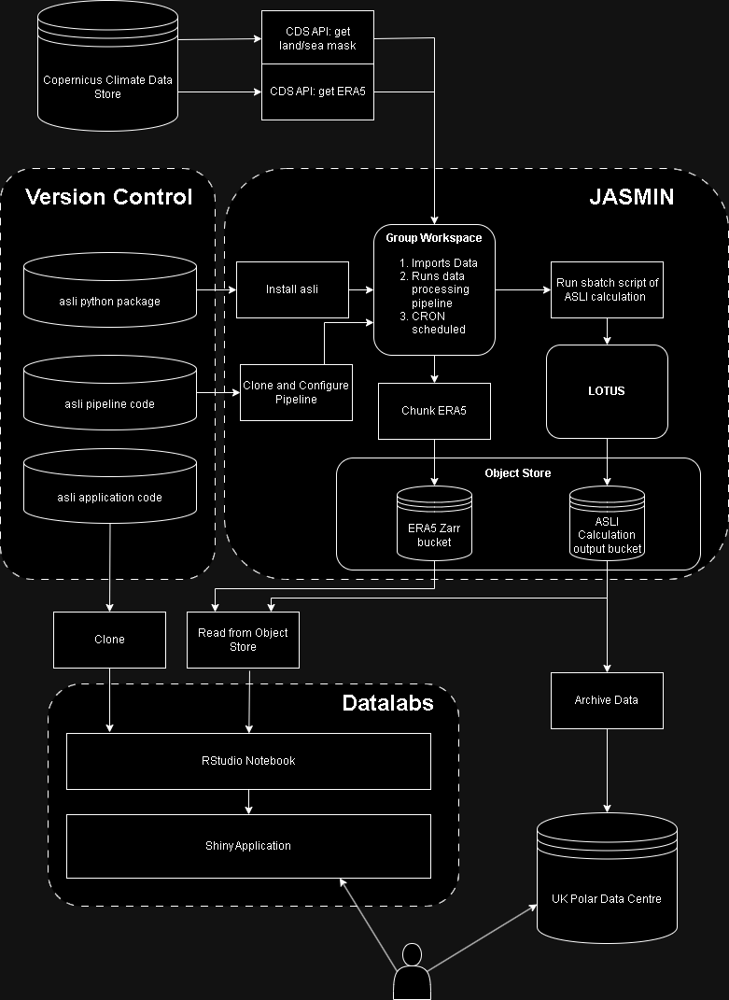

# Deployment Example
The following describes an example deployment setup for this pipeline. This was done under the BOOST-EDS project.

We are using a [JASMIN](https://jasmin.ac.uk/) group workspace (GWS) to run a data processing pipeline. Using the [Copernicus Climate Data Store API](https://cds.climate.copernicus.eu/#!/home), ERA5 data is read in. Calculations are then performed on [LOTUS](https://help.jasmin.ac.uk/docs/batch-computing/lotus-overview/) using `asli` functions.Output data is stored on [JASMIN Object Storage](https://help.jasmin.ac.uk/docs/short-term-project-storage/using-the-jasmin-object-store/). This data is read in and displayed by this application. This application in turn is [hosted on Datalabs](https://datalab.datalabs.ceh.ac.uk/). 

This means compute, data storage and application hosting are all separated. 

## Portability
Each component listed above could also be deployed on different suitables infrastructures, for example BAS HPCs or commercial cloud providers.

## Interaction with Datalabs
The results of this pipeline are displayed in an [application hosted on Datalabs](https://ditbas-asliapp.datalabs.ceh.ac.uk/).

Follow this [tutorial to see how Datalabs and the JASMIN Object Store interact](https://github.com/NERC-CEH/object_store_tutorial/tree/main).
